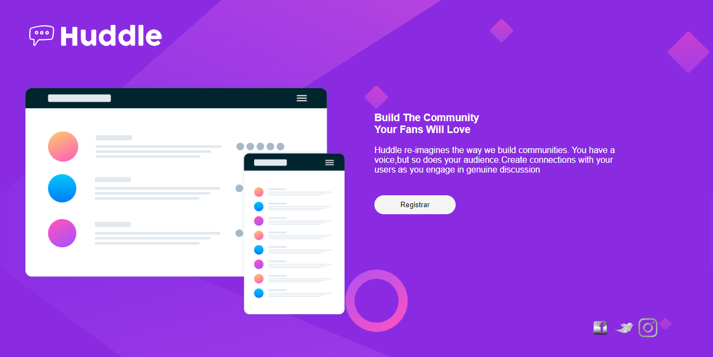

# FRONT-END-MENTOR
> Primeiro projeto com css e html !

   PROJETO BASEADO NA PLATAFORMA FRONTEND-MENTOR, QUE SUGERE ALGUNS DESAFIOS DE DIVERSOS NÍVEIS DE DIFICULDADE.

   ESSE EM PARTICULAR CONSISTE, EM CLONAR UMA PÁGINA WEB, FAZENDO USO DE HTML E CSS.
   
   

   ###### Técnicas aplicadas:

   - Tags semânticas.
   - Primeira versão do projeto.

   ###### META:

   Jorge Augusto - [linkedin](https://www.linkedin.com/in/jorgeaugusto88/)

   